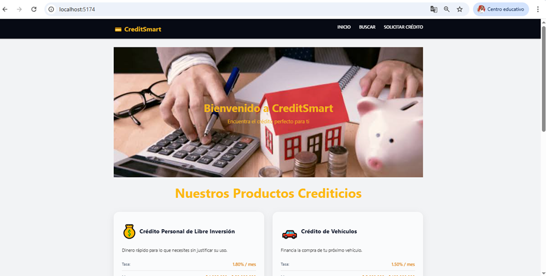
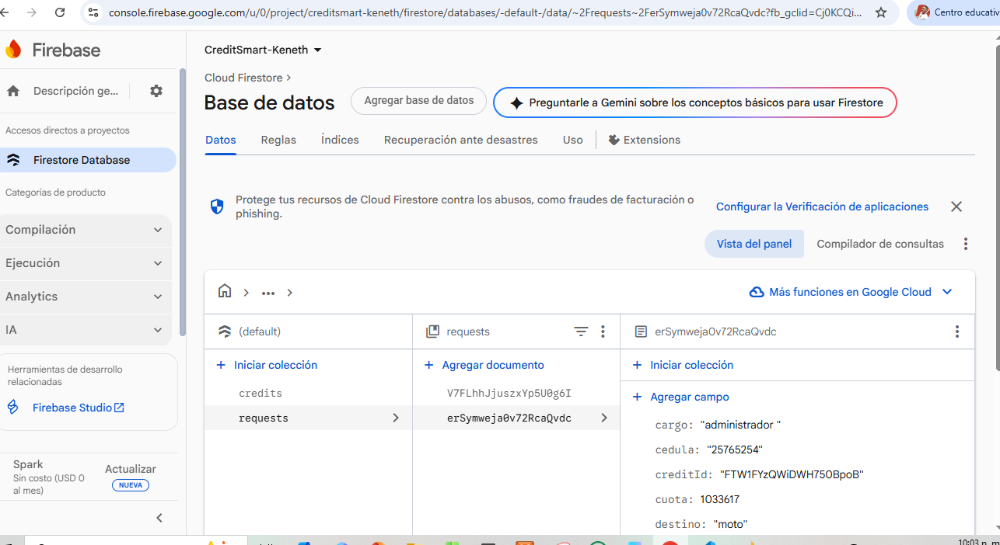

# S30 - S40 - EA3: Integración con Backend Firebase - CreditSmart- React + Vite

*Autores:* Keneth Anderson Dávila Cuesta e Isai Manuel Narvaez Redondo

## Descripción
Aplicación de ejemplo para consultar, simular y solicitar créditos, la  cual ya guarda las solicitudes enviadas en la nube, así cm la información de las cards.

## Tecnologías
- React
- Vite
- React Router

## Instalación
1. npm install
2. npm run dev para iniciarla

## Instrucciones de la app

1. Abril la terminar de VSCODE y escribir npm run para correr iniciar la app.

## Estructura
- src/ : código fuente
- public/: (si aplica)
- package.json

## Commits
Ejemplo de commits: git commit -m "Configuración inicial", git commit -m "Componente CreditCard creado", ...

## Configuración Firebase
1. Crear proyecto en Firebase
2. Registrar app web y copiar config al `.env`
3. Habilitar Firestore y crear colección `credits` con documentos (name, rateMonthly, min, max, termMax, description, icon)
4. Crear colección de solicitudes enviadas (requests) qué almacenes todas las solicitudes enviadas desde la app.
5. La app lee `credits` en tiempo real y guarda solicitudes en la colección `requests`.

